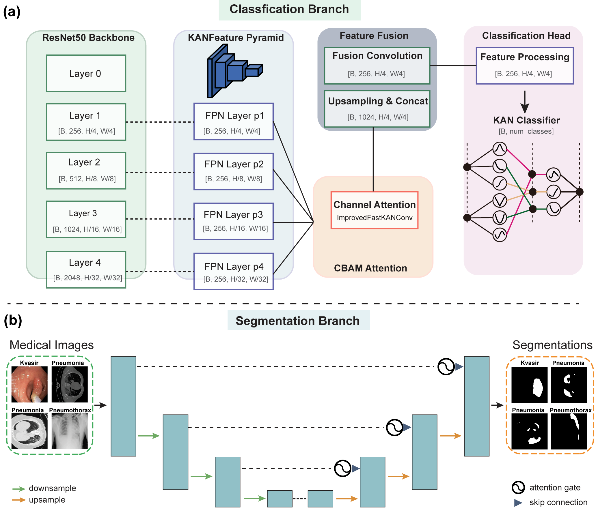
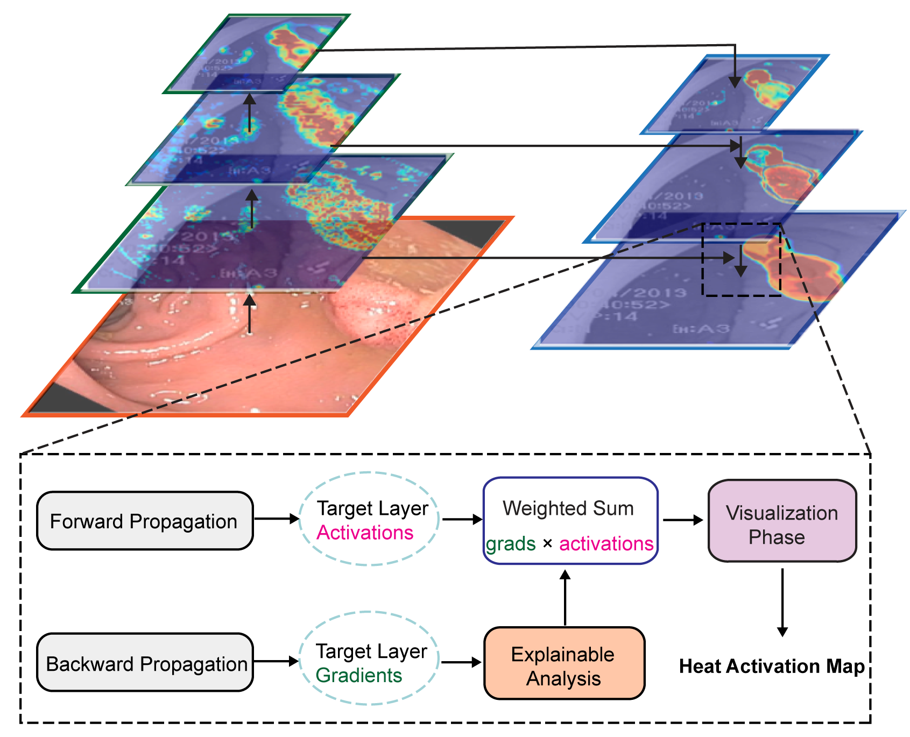

# UniMedX: A Unified Kolmogorov-Arnold Theory Guided Framework for Interpretable Medical Image Classification and Segmentation

The official implementation of **UniMedX**





## Dependencies

UniMedX was implemented on *Ubuntu 20.04* with *Python 3.10*. Before training and testing, please create a conda environment and install PyTorch 2.1.2 as follows:

```shell
conda create -n UniMedX python=3.10
source activate UniMedX
conda install torch==2.1.2
```

Please install other packages using `pip install -r requirements.txt`.

## Quick test for performance

```bash
#for classification path
python test_cls.py \
  --model_path /root/autodl-tmp/result/models/chest_xray_cls/best_model.pth \
  --input_channels 3 \
  --num_classes 2 \
  --dataset chest_xray \
  --data_dir /path/to/dataset \
  --csv_path path/to/dataset.csv \
  --output_dir //path/to/output \
  --batch_size 16

#for segmentation path
python test_seg.py --model_path /path/to/model.pth --data_dir /path/to/dataset --output_dir /path/to/output --batch_size 4
```

## Training method

```bash
# training classification
python train_cls.py --epochs 500 --batch_size 16 --dataset "datasets name" --data_dir "/path/to/data" --output_dir "/path/to/output" --model_name "cls" --num_classes 2

# training segmentation
python train_seg.py --epochs 500 --batch_size 4 --dataset "datasets name" --data_dir "/path/to/dataset" --output_dir "/path/to/output" --model_name "seg" --num_classes 1 
```


## Citation


If you have any questions, Contact us via mingyangcheng@stu.hznu.edu.cn.